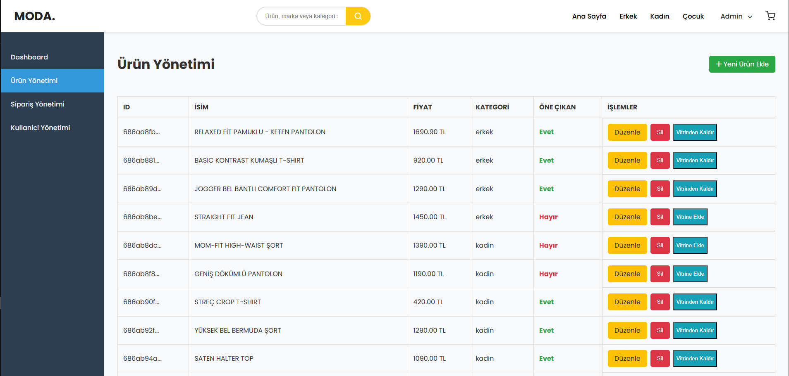

[Read this document in Turkish (Türkçe)](README_tr.md)

# MODA - Full-Stack E-Commerce Platform

This project is a fully functional e-commerce web application built from scratch using modern web technologies. It includes a rich set of features for both customers and administrators.

## 🚀 Project Goal

The primary goal of this project was to gain hands-on experience in developing a modern MERN stack application from start to finish, creating a professional and scalable codebase, and implementing the core and advanced features required for an e-commerce platform.


## ✨ Features

### Customer-Facing Features

-   **User System:** Secure user registration and login with password hashing.
-   **Dynamic Homepage:** A homepage featuring main categories and "Featured Products" curated by the admin.
-   **Product Discovery:**
    -   Product listing by category (`/category/:categoryName`).
    -   A search functionality to find products by name.
-   **Detailed Product Page:** A dedicated page for each product with detailed information, images, and descriptions.
-   **Review System:** A secure system allowing only users who have purchased a product to leave a rating and a comment.
-   **Favorites (Wishlist):** Allows users to save their favorite products to their personal profile.
-   **Shopping Cart:** Dynamically add, remove, and update the quantity of products in the cart.
-   **Checkout Process:**
    -   Shipping address entry.
    -   Payment method selection.
    -   Order summary and confirmation.
-   **User Profile:** Users can view their past orders and track their status (Delivered/Pending).

### Admin-Side Features

-   **Secure Admin Panel:** Protected routes and API services accessible only to users with `isAdmin` privileges.
-   **Dashboard:** A landing page with summary statistics like total users, products, orders, and total revenue.
-   **Product Management:**
    -   List all products.
    -   Full CRUD (Create, Read, Update, Delete) functionality for products.
    -   Ability to mark products as "Featured" to manage the homepage showcase.
-   **Order Management:** View all orders from all users, inspect details, and mark orders as "Delivered".
-   **User Management:** List all users in the system, delete users, and grant/revoke admin privileges.

## 🛠️ Tech Stack

### Backend

-   **Node.js:** JavaScript runtime environment.
-   **Express.js:** Fast, unopinionated, minimalist web framework.
-   **MongoDB:** NoSQL database.
-   **Mongoose:** Elegant MongoDB object modeling for Node.js.
-   **JSON Web Tokens (JWT):** For authentication and authorization.
-   **Bcrypt.js:** For secure password hashing.
-   **ES Modules:** Modern JavaScript module system.

### Frontend

-   **React.js:** A JavaScript library for building user interfaces.
-   **React Router:** Declarative routing for React.
-   **Context API:** For global state management (Auth, Cart, Favorites).
-   **React Hot Toast:** Modern and stylish notifications.
-   **CSS:** Custom styling with Flexbox and Grid for a modern and responsive design.

## 🏁 Running the Project Locally

To run this project on your local machine, follow these steps:

1.  **Clone the Repository:**

    ```bash
    git clone [https://github.com/efeozell/giyim-sitesi-projesi.git](https://github.com/efeozell/giyim-sitesi-projesi.git)
    cd giyim-sitesi-projesi
    ```

2.  **Setup the Backend:**

    ```bash
    cd giyim-sitesi-backend
    npm install
    ```

    Create a `.env` file in the `giyim-sitesi-backend` folder and add your `MONGO_URI`, `PORT`, and `JWT_SECRET` variables.

    ```bash
    npm run dev
    ```

3.  **Setup the Frontend:**

    ```bash
    cd ../giyim-sitesi-frontend
    npm install
    npm start
    ```

    The application will be available at `http://localhost:3000`.

    
    
    
    

    **ADMIN KISIMLARI**
    
    
