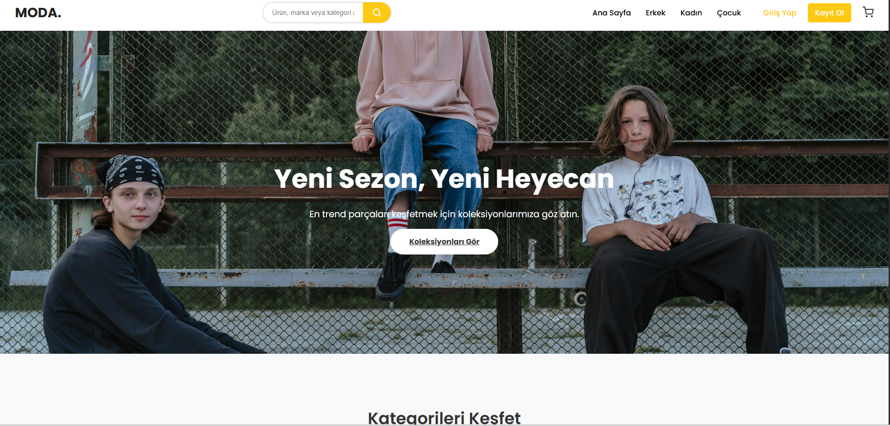
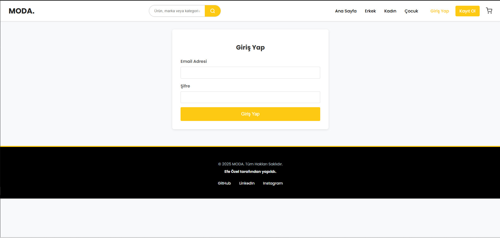
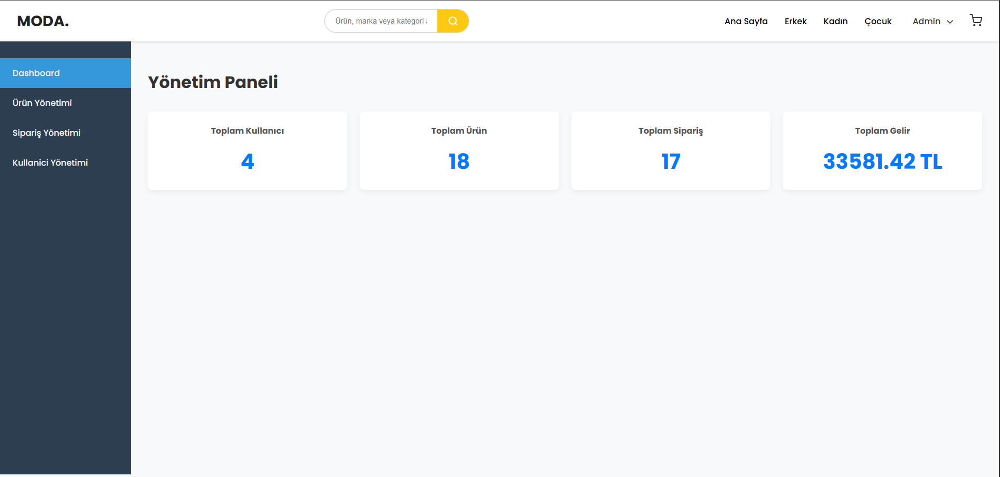

[Bu dokümanı İngilizce olarak okuyun (English)](./README.md)

# MODA - Full-Stack E-Ticaret Platformu

Bu proje, modern web teknolojileri kullanılarak sıfırdan inşa edilmiş, tam fonksiyonel bir e-ticaret web uygulamasıdır. Hem müşteri hem de yönetici (admin) tarafı için zengin özellikler barındırır.



## 🚀 Projenin Amacı

Bu projenin temel amacı, baştan sona modern bir MERN stack uygulaması geliştirme sürecini deneyimlemek, profesyonel ve ölçeklenebilir bir kod tabanı oluşturmak ve bir e-ticaret platformunun sahip olması gereken temel ve ileri düzey özellikleri hayata geçirmektir.

## ✨ Özellikler

### Müşteri Taraflı Özellikler

-   **Kullanıcı Sistemi:** Güvenli şifreleme ile kullanıcı kaydı ve girişi.
-   **Dinamik Ana Sayfa:** Admin tarafından belirlenen "Öne Çıkan Ürünler" ve ana kategoriler.
-   **Ürün Keşfi:**
    -   Kategoriye göre ürün listeleme (`/kategori/:categoryName`).
    -   Ürün ismine göre arama fonksiyonu.
-   **Detaylı Ürün Sayfası:** Her ürün için özel, detaylı bilgi, resim ve açıklama sayfası.
-   **Ürün Değerlendirme Sistemi:** Sadece ürünü satın almış kullanıcıların puan verip yorum yapabildiği güvenli bir sistem.
-   **Favoriler (İstek Listesi):** Kullanıcıların beğendikleri ürünleri kendi profillerine kaydetmesi.
-   **Alışveriş Sepeti:** Dinamik olarak ürün ekleme, çıkarma ve miktar güncelleme.
-   **Sipariş Süreci:**
    -   Kargo adresi girme.
    -   Ödeme yöntemi seçme.
    -   Sipariş özeti ve onaylama.
-   **Kullanıcı Profili:** Geçmiş siparişlerin detaylarını ve durumunu (Teslim Edildi/Bekliyor) takip etme.

### Admin (Yönetici) Taraflı Özellikler

-   **Güvenli Admin Paneli:** Sadece `isAdmin` yetkisine sahip kullanıcıların erişebileceği, korumalı rotalar ve API servisleri.
-   **Dashboard:** Toplam kullanıcı, ürün, sipariş sayısı ve toplam gelir gibi özet istatistiklerin olduğu bir karşılama ekranı.
-   **Ürün Yönetimi:**
    -   Tüm ürünleri listeleme.
    -   Yeni ürün ekleme, mevcut ürünleri düzenleme ve silme (CRUD).
    -   Ürünleri "Öne Çıkan" olarak işaretleyerek ana sayfa vitrinini yönetme.
-   **Sipariş Yönetimi:** Sitedeki tüm siparişleri görme, detaylarını inceleme ve "Teslim Edildi" olarak işaretleme.
-   **Kullanıcı Yönetimi:** Sistemdeki tüm kullanıcıları listeleme, silme ve admin yetkisi verme/alma.

## 🛠️ Kullanılan Teknolojiler

### Backend

-   **Node.js:** JavaScript çalışma ortamı.
-   **Express.js:** Hızlı ve minimalist web uygulama çatısı.
-   **MongoDB:** NoSQL veritabanı.
-   **Mongoose:** MongoDB için şık bir nesne modelleme aracı.
-   **JSON Web Tokens (JWT):** Kimlik doğrulama ve yetkilendirme için.
-   **Bcrypt.js:** Güvenli şifre hash'leme.
-   **ES Modules:** Modern JavaScript modül sistemi.

### Frontend

-   **React.js:** Kullanıcı arayüzleri oluşturmak için JavaScript kütüphanesi.
-   **React Router:** Tek sayfa uygulamalar için dinamik yönlendirme (routing).
-   **Context API:** Global state yönetimi (Auth, Cart, Favorites).
-   **React Hot Toast:** Modern ve şık bildirimler.
-   **CSS:** Özel stillendirme, Flexbox ve Grid ile modern ve duyarlı (responsive) tasarım.

## 🏁 Projeyi Yerel Makinede Çalıştırma

Projeyi kendi bilgisayarınızda çalıştırmak için aşağıdaki adımları izleyin:

1.  **Projeyi Klonlayın:**

    ```bash
    git clone [https://github.com/efeozell/giyim-sitesi-projesi.git](https://github.com/efeozell/giyim-sitesi-projesi.git)
    cd giyim-sitesi-projesi
    ```

2.  **Backend Kurulumu:**

    ```bash
    cd giyim-sitesi-backend
    npm install
    ```

    `giyim-sitesi-backend` klasöründe bir `.env` dosyası oluşturun ve içine `MONGO_URI`, `PORT` ve `JWT_SECRET` değişkenlerinizi ekleyin.

    ```bash
    npm run dev
    ```

3.  **Frontend Kurulumu:**
    ```bash
    cd ../giyim-sitesi-frontend
    npm install
    npm start
    ```
    Uygulama `http://localhost:3000` adresinde çalışmaya başlayacaktır.





**ADMIN KISIMLARI**


